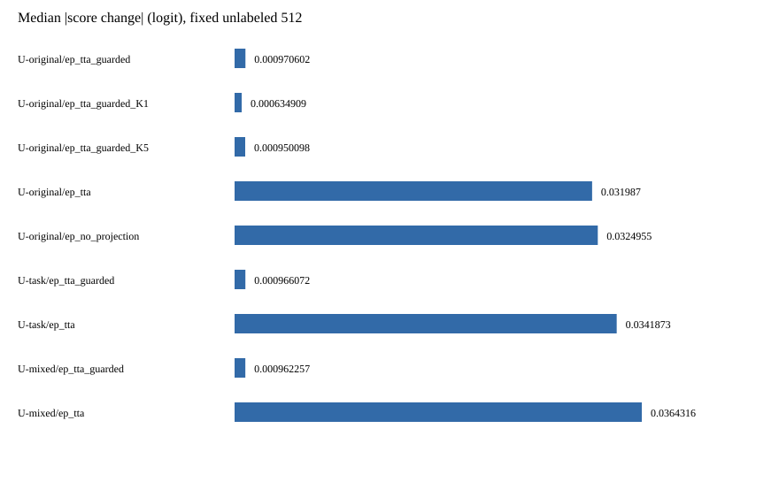
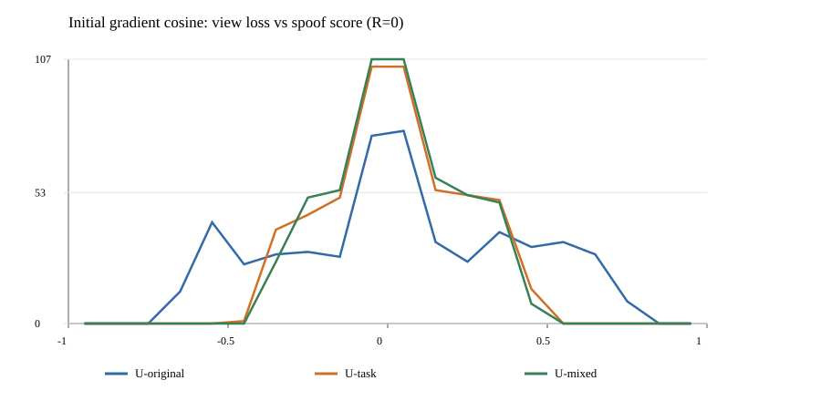

# EP-TTA 纠错能力与梯度几何审计

日期：2026-10-09。性质：**无标签数值诊断**，没有运行新的目标有标签评价，也没有新的 EER 结论。

## 结论与 Go/No-Go

1. **适应器能改变鉴伪分数。** 原 U 保留分类头方向平方范数的 32.60%，不是严格分数零空间；在 `rho=0.2` 下，固定 512 条样本的理论 `|Δs|` 上界中位数为 1.7334 logit。实际受硬保护的 `|Δs|` 中位数仅 0.000971；无硬保护、仍有投影时为 0.031987。问题首先表现为**实际更新被限制**，并非数学上完全不能更新。
2. **当前无标签目标没有显示稳定的分类决策方向。** 在 `R=0`，原 U 的视图损失梯度与 spoof 分数梯度余弦中位数为 0.0159，10%/90% 分位数为 −0.5100/0.5561；一阶下降方向对 spoof 分数的影响正负都有。受保护的最终分数变化为 238 条升高、274 条降低。由于没有使用目标标签，这些符号**不能**解释为有益或有害纠错。
3. **No-Go：单独替换 U 并宣传无标签收益。** U-task、U-mixed 都把完整分类头方向纳入 8 维子空间，理论上界中位数提高至 2.965/3.034，但同样硬保护下的 `|Δs|` 中位数仍约 0.00096。**Go：优先研究有可信鉴伪关联的无标签目标，同时单独控制硬保护的约束强度；**在相同冻结表征、固定 assignment、预注册参数下验证，先在两个独立且确实双类的开发域观察排序和损害。已有 O1/O2/O3 与简单保护替代品的负结果必须作为约束，不把它们直接重命名为新方法。现有证据不足以优先启动新的 80-epoch SSL-AASIST 训练，也不足以宣称上游表征没有问题。

## 基线、范围与历史对照

- 工作树：`.worktrees/ep-capacity-geometry-20261009`；分支：`codex/ep-capacity-geometry-20261009`；基线提交：`66680217720532388ff241bbb88a8565788cf297`；最终数值由已提交代码 `3926d63dbb301785ee09072165924e832eb5d04a` 产生。原工作树在 `exp-task-objective-discovery` 有未提交的数据接入改动；本审计没有改动它们。
- 冻结模型：`outputs_v2/ssl_aasist/frozen/bundle.json`，项目内源训练 `source-20260919T083421Z-a61b23`，`source_val` 选出的具体 `epoch_0007.pt`，160 维最后线性头输入。通用 XLS-R 300M 只初始化 SSL 前端；鉴伪头和后端来自本项目训练。模型导出记录 native `bonafide=1, spoof=0`；审计按 `W_spoof−W_bonafide` 和 `b_spoof−b_bonafide` 输出，`0=bonafide, 1=spoof`，分数越大越偏 spoof。
- 无标签输入：原有 `in_the_wild_mechanism_select.json` 的固定 512 个 target10 ID，按保存顺序读取既有 `cache-target-in_the_wild` 中的 `3×160`、float32 特征。缓存索引声明 `source_run_id/checkpoint/preprocess/dataset/role` 与冻结包一致；仅将所选 512 个 ID 物化为实验输入。没有读取 target90 或最终 holdout 标签、目标攻击字段、历史目标标签或以目标结果重新选样。
- 源输入：既有 `outputs_v2/ssl_aasist/resources` 的 fit 角色平衡源锚点、源标签、原 U、w 和 cal0 阈值；U-task 与 U-mixed 只由这些源资源生成。没有重新划分 assignment、提取波形、GPU 前向或训练。
- 历史参考而非本次复测：`docs/research/CURRENT_EVIDENCE.md` 记录 target10 3,178 条 Frozen EER 0.0985707、episodic 0.0983464；guarded oracle 在既有候选内仅改善 0.0002243 EER，硬保护触发频繁。`DECISION_LOG.md` 和 `RESEARCH_LEDGER.md` 记录 guard 松绑、源保持及 O1/O2/O3 的负面或单域证据。它们支持本审计的提问，**不能**代替本次未运行的目标标签评价。

## 公式、语义与数值核对

令 `z` 为列向量，`q=Uᵀz`、`c=Uᵀw`、`s(z)=wᵀz+b`。实际行向量代码为 `Z + ((Z @ U) @ R.T) @ U.T`，故

\[
\Delta s=s(A_R(z_0))-s(z_0)=w^\top U R U^\top z_0=c^\top Rq,
\qquad \nabla_Rs=cq^\top.
\]

若 `UᵀU=I` 且 `||R||_F≤rho`，则 `|Δs|≤rho||c||₂||q||₂`。这个上界可由沿 `cqᵀ` 的秩一 R 达到，表达**允许的分数容量**，不表示当前 SGD 会达到。`U-original` 的 `||Uᵀw||²/||w||²=0.326030`，即头方向范数比例约 0.571。三种 U 的最大正交误差分别为 `2.38e−7 / 2.98e−7 / 3.58e−7`。

`L_view` 在 `R=0` 的梯度是 `2 Q_cᵀQ_c/(N d)`，其中 `Q_c` 是 3 个视图在 U 中的中心化坐标；秩至多 2。源 margin 保持项在 `R=0` 的损失和梯度为零，因此第一步由视图损失决定。以 `cos(∇L_view, ∇s)` 度量无标签下降方向与 spoof 分数方向的夹角；正余弦表示第一步倾向降低 spoof 分数，负余弦表示倾向升高，均不能在无目标标签时判定正确性。

审计从冻结 `detector_state.pt` 的 `out_layer.weight:[2,160]` 和 `out_layer.bias:[2]` 独立导出 native 差值，与源资源的 `w,b` 最大绝对差均为 **0**。已有冻结导出 parity 记录 `head_score_max_abs=4.768e−7`、状态 `PASS`；本次在全部 512 条上再次检查 Frozen 与 K=0 **逐条精确相等**。生产实现分数变化与公式的最大绝对差：有投影臂不超过 `2.15e−6` logit；无投影臂因极端值为 `3.78e−4`，相对差最大 `4.08e−6`。全部有投影臂的上界超出量为 0；全部数值回退计数为 0。

## 三个固定 8 维 U

| 名称 | 严格源域构造 | `||Uᵀw||²/||w||²` |
|---|---|---:|
| U-original | 保存的 fit 类×处理家族平衡、未中心化响应二阶矩的前 8 特征向量 | 0.326030 |
| U-task | 训练头方向 `w`，fit 源锚点的双类均值差残差，再由源锚点中心化协方差补足到 8 维；双重正交化 | 1.000000 |
| U-mixed | 训练头方向 `w`，再依原 U 顺序取 7 个正交化后的响应方向 | 1.000000 |

U-task 使用了**源标签监督**构造任务几何；这不是无标签目标效果，也不属于新的目标测试收益。三种 U 的其余适应器、维度、K、步长、半径、源锚点和视图完全相同。源 fit 锚点不含目标标签；没有根据目标开发结果挑选方向或固定样本。

## 数据表：容量、梯度与实际分数移动

下表是固定 512 条样本的无标签描述统计。所有 `|Δs|` 单位是 spoof logit 差值；`G_view` 和 `G_score` 是 `R=0` 的 Frobenius 梯度范数中位数。K10 使用既有 `lr=0.3, rho=0.2, gamma=0.1, lambda_keep=1`；“无硬保护”仍做 Frobenius 投影。

| U / 执行臂 | 分类投影 | 上界中位数 | `|Δs|` 中位数 / P90 | `||G_view||` / `||G_score||` 中位数 | 梯度余弦中位数 | R 范数中位数 |
|---|---:|---:|---:|---:|---:|---:|
| original / 硬保护 K10 | .3260 | 1.7334 | .000971 / .123517 | .01077 / 8.66686 | .01589 | .000863 |
| original / 无硬保护 K10 | .3260 | 1.7334 | .031987 / .885833 | .01077 / 8.66686 | .01589 | .030877 |
| task / 硬保护 K10 | 1.0000 | 2.9649 | .000966 / .047776 | .00858 / 14.82441 | .00794 | .000643 |
| task / 无硬保护 K10 | 1.0000 | 2.9649 | .034187 / 1.476064 | .00858 / 14.82441 | .00794 | .025389 |
| mixed / 硬保护 K10 | 1.0000 | 3.0343 | .000962 / .100357 | .01048 / 15.17162 | .00637 | .000907 |
| mixed / 无硬保护 K10 | 1.0000 | 3.0343 | .036432 / 1.355441 | .01048 / 15.17162 | .00637 | .031009 |

原 U 的受保护实际 `|Δs|/理论上界` 逐样本比值中位数为 `0.000562`。把完整头方向纳入 U 后，此比值为 `0.000327`（task）和 `0.000318`（mixed）。原 U 有硬保护和无硬保护的配对 `|Δs|` 比较：338 条前者更小、167 条相同、7 条更大。视图损失在原 U 硬保护下 512/512 条下降；无硬保护下为 90.625%。这说明**下降的是辅助损失**，没有由此证明鉴伪排序改善。

## 步数、投影、硬保护与回退

| 原 U 执行臂 | `|Δs|` 中位数 / P90 | 每步投影触发 | 每步硬保护触发 | 每步硬保护回退 | margin 正则梯度非零步占比 |
|---|---:|---:|---:|---:|---:|
| 硬保护 K1 | .000635 / .015884 | 4.30% | 49.41% | 0% | 0% |
| 硬保护 K5 | .000950 / .062390 | 4.41% | 58.59% | 3.95% | 30.8% |
| 硬保护 K10 | .000971 / .123517 | 4.71% | 62.58% | 21.13% | 47.9% |
| 无硬保护、保留投影 K10 | .031987 / .885833 | 10.92% | 0% | 0% | 39.0% |
| 无投影且无硬保护 K10（机制诊断） | .032495 / 52.241678 | 0% | 0% | 0% | 39.9% |

K1 时保持项初始梯度为零，与数学约定一致。K5→K10 的中位分数移动几乎不再增长，同时回退率大幅上升，说明额外优化步很大一部分被硬保护抵消。原 U 硬保护 K10 平均每步 7.31 次二分回溯（上限 16）。无投影臂的 P90 分数变化达到 52.24 logit，最大违反原 `rho` 上界 9,428.85 logit；它**不属于合法受限 EP 候选**，只显示投影在极端样本上的数值保护作用。无硬保护的显著更大更新仅说明“能动”，没有标签证据说明“动得对”。

## 实际命令、退出码与日志

工作目录均为该独立工作树；训练、提取、TTA 和 pytest 全部由 `tta` conda 环境运行。最终复放是**已提交代码** `3926d63`。大型逐样本 CSV、快照和运行日志位于忽略的 `local/ep_capacity_audit/run_20261009f/`；仓库只提交小型 `summary.json` 与两张 SVG。

| 命令 | 退出码 | 记录 |
|---|---:|---|
| `PYTHONPATH=src conda run --no-capture-output -n tta python -m pytest tests/unit/test_ep.py tests/unit/test_mechanisms.py tests/unit/test_guard_capacity.py tests/unit/test_offline.py tests/unit/test_task_subspaces.py -q` | 0 | `pytest.log`：75 passed in 3.63s |
| `PYTHONPATH=src conda run --no-capture-output -n tta python experiments/ep_capacity_audit/run_geometry.py --data-root /media/dell/data/fakeAudioDection/TTA --output local/ep_capacity_audit/run_20261009f` | 0 | `run.log`：COMPLETE，512 ID，9 个执行臂；完整逐样本记录在 `per_sample.csv` |
| `conda run -n tta python experiments/ep_capacity_audit/plot_geometry.py --input local/ep_capacity_audit/run_20261009f/per_sample.csv --output local/ep_capacity_audit/run_20261009f/gradient_cosine.svg` | 0 | 512×3 梯度余弦图；两张 SVG 的 XML 解析也退出 0 |
| `sha256sum`（下表列出的只读模型/输入文件及本地有序特征快照） | 0 | 命令输出记录于本报告；哈希只用于这次来源报告，不参与项目业务判断或门禁 |

最初的 `run_20261009a` 因脚本入口缺少 `PYTHONPATH=src` 退出 1；`run_20261009b` 因审计检查误将无投影臂也要求满足 `rho` 上界而退出 1。修正后 `run_20261009c/d/e` 退出 0，并保留本地记录；最后的 `run_20261009f` 是提交后复放，`e/f` 的 `summary.json` 逐字节一致。这些失败是审计脚本问题，不是科学负结果。`tta` 环境缺少 Matplotlib 依赖 `pyparsing`（导入命令退出 1），图改用标准 SVG 输出；没有安装依赖。

## 模型与输入 SHA-256（仅报告来源）

| 对象 | SHA-256 |
|---|---|
| `epoch_0007.pt` 源训练 checkpoint | `dbf1d5b5229ffe5b904e5a7bef2c0a42181c9be6e7195d1c5c5b84a6a01ec6df` |
| `frozen/bundle.json` | `300550c9dbb24f80edfe9082b8e71a8e54835f48aff493be4dfe675fd1d77ecb` |
| `frozen/detector_state.pt` | `0b11a86b7634b6b80e3f88aa707f209732f5bd1d7b369b5e8a5ebfb4051b382d` |
| `frozen/linear_head.pt` | `1b088e22879eacaef973eb68c262aa2e277877cc55342b3b66e801c73e2fb189` |
| 源 `resources/U.npy` | `9f80a507cdb7deaefc52c1c981daa81c2d50bc3020e65ffb982c6da0d9f60399` |
| 源 `resources/anchors_z.npy` | `8468e13f5b229922d60ddae631c9a9735e4bfad9a954b2ccff32d23f73866aeb` |
| 目标缓存 `index.json` | `2ef58febe5dfebc0ed18e4705a765553b5e9698d9264682772a8da0603334cf7` |
| 固定 512-ID manifest | `f9b4ee751ddda495066ab2fc9661e763650d8f69e2143ffcbef4f23c290235c0` |
| 本地 `selected_features_ordered.npy`，按固定 ID 排序，`[512,3,160]` float32 | `c95fd1349f53e7d99f2f21299cb9dc4c8a60b27a94a84855e27ccd6d3d54f7bf` |
| 本地 `U_task.npy` / `U_mixed.npy` | `aecdfca5096c069c556287e29b14c16f53a774d31822b9ba6acf2160f588a259` / `ae62574075ffc3e3a530966f36cbec2c8acf3550a55fdfdf244e9c8b59553033` |

哈希是本次人工审计记录，不是项目运行时的完整性校验；普通元数据字段不符仍会失败。无内容摘要门禁时，不能声称自动检测同名外部文件的原地替换。选中特征快照在复放后由相同只读缓存及固定 ID 再导出，其 SHA 与前次独立运行相同。

## 失败边界与下一步

- 本次没有打开任何目标标签，没有计算本次 EER/AUC、翻转有益率或跨域泛化。历史 target10 开发 EER 只能说明现有方法收益很小，不能把本次无标签梯度符号直接对应到正确分类。
- `U-task` 与 `U-mixed` 把 `w` 放入 U；它们提高分数可变上界，但在现行硬保护下未提高中位实际分数移动。原 U 已有可观的理论任务方向容量，因此**U 的维度/方向失配不是当前唯一且最直接的瓶颈**。
- 无硬保护增强移动，但历史 guard 对照显示某些设置会损害目标排序和源证据；不得据此直接去掉保护。无投影的极端变化尤其不能成为候选方法。
- 视图方差目标的初始梯度只依赖三视图差异，不接收目标标签，也没有从本次数据证明其与伪造判别一致。下一轮应预先定义同 U、同参数预算的损失与 guard 双因素对照，先做无标签梯度和源损害检查，再把双类开发标签作为**单独事后诊断**使用。若没有合规的第二双类开发域，应保持方法推广与上游重训为 No-Go；target90 和最终 holdout 标签继续封闭。
